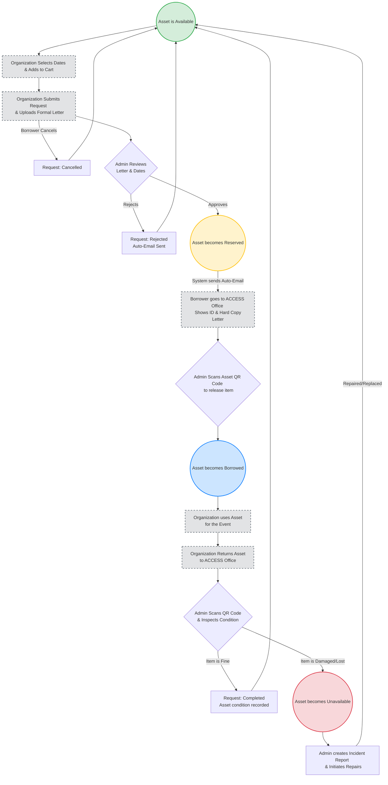

# Borrowing Workflow & Asset State Flowchart

This flowchart visualizes the continuous lifecycle of an Asset and the step-by-step process a Borrower and Admin go through during a single borrowing transaction.

### State Definitions:
1. **Available (Green)**: The asset is currently in the ACCESS office and can be booked by anyone for future dates.
2. **Reserved (Yellow)**: A request has been approved for this asset. It is still in the office, but it is "held" for a specific organization and cannot be booked by others for overlapping dates.
3. **Borrowed (Blue)**: The physical handoff has occurred. The asset is currently in the possession of the Organization.
4. **Unavailable (Red)**: The asset has been reported damaged, lost, or is undergoing maintenance. It cannot be booked by anyone until an Admin resolves the issue and marks it Available again.
