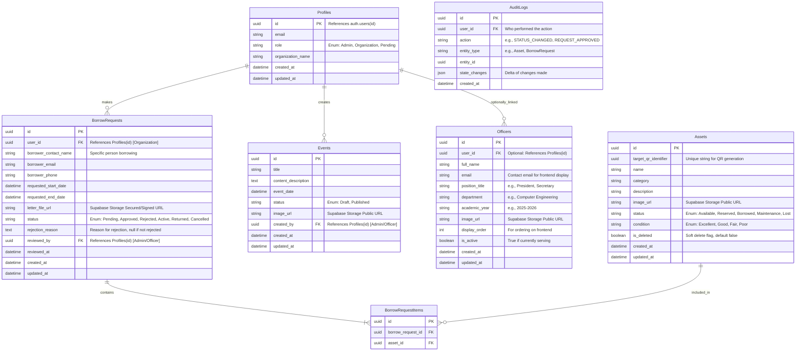

# Entity Relationship Diagram (ERD)

The following Mermaid diagram outlines the relational database structure needed to support the ACCESS Borrowing System, CMS, and Asset Tracking.

> [!IMPORTANT]
> This schema uses Supabase Auth for authentication. The `Profiles` table extends `auth.users` — passwords are managed entirely by Supabase, NOT stored in your application tables.

